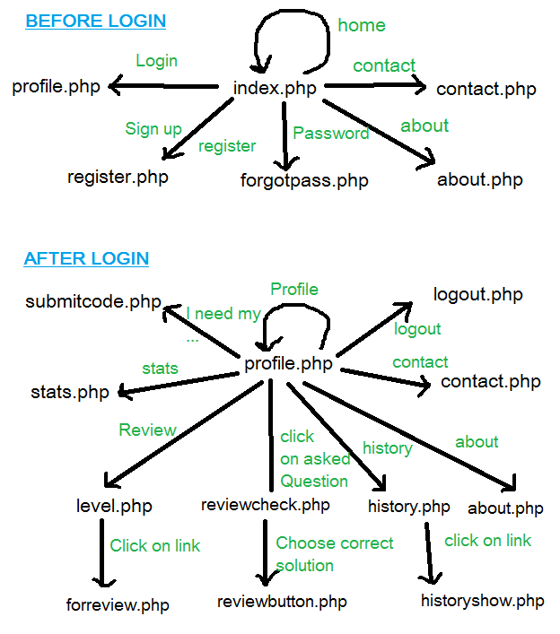
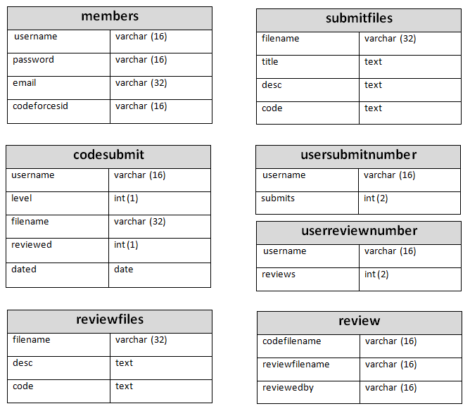

# Welcome to the open source codebase of codereview.orgfree.com
This code is running live at [http://codereview.orgfree.com/](http://codereview.orgfree.com/).

## File Structure

 	adapters 	- jquery.js (Used by ckeditor below)
	ckeditor 	- Code highlighter for the editors used in forreview.php and historyshow.php
	css 		- Bootstrap.css
	js 		- Bootstrap.js and jquery.js
	BingSiteAuth.xml - Bing site tracker script	
	about.php 	- All the content of the about page of the main site.
	analyticstracking.php - Google analytics tracking script	
	contact.php 	- A simple contact us form with name,email,message and submit button.
	footer.php 	- Common footer code for the website with stats/tracking script and some content.
	forgotpass.php 	- Simple form asking for email and the password is sent on that email upon submission.
	forreview.php 	- Page on which the user submits his solution to the problem asked.
	functions.php 	- Useful functions used throughout the codebase (PHP to SQL, Strings, Curl requests).
	google0ebb62ff7cfe67cb.html - Google site verification.
	header.php 	- Common header code for the website with meta, links (CSS, JS) and navbar.
	history.php 	- History page showing list of previous questions asked by the user.
	historyshow.php - When a user selects a question from his history, the problem and the correct solution is shown.
	index.php 	- Homepage/ Main page (This is the onlly page with its own header and footer code included).
	level.php 	- Review page (Available once you sign-in) showing list of all active questions.
	logout.php 	- Small code when user logs out by clicking on log out button (Available after sign-in).
	profile.php 	- Profile page (Available once you sign-in) with code for getting codeforces rating using Curl. 
	register.php 	- Register page and code to verify codeforces user using Curl.
	reviewbutton.php - Code run when a user slects a correct answer on reviewcheck.php page.
	reviewcheck.php - When a user clicks on a question he asked (on profile page), he comes here.
	sitemap.xml 	- Sitemap
	stats.php 	- Stats page (Available once you sign-in)
	styles.css 	- Small CSS code for buttons in header navbar
	submitcode.php 	- When user submits his problem/question.

## Website pages linkage

Description of the how all the pages are linked to each other.

## Database

Description of the database (CR_DB) structure in detail.

## Setup required to test changes/contributions locally
1. Download and install 
2. Setup 'CR_DB' database using phpmyadmin which comes with wampServer using the CR_DB database diagram shown above in this readme.
3. Now to see the website locally in action go to the wampServer running port on your browser eg. http://localhost:8080/socialsearch/index.php

## Contribution

1. Liquid layout
2. More statistics on stats page

3. Rewriting about page
4. Removal of redundant code
5. Better code highlighter (ckeditor doesn't works on code snippet)
6. Better user profile page
7. User messaging
8. Reduce site loading time
9. Reduce the number of external css/js files used in header
10. Externalize the inline CSS.
11. Externalize the inline JS.
12. Externalize the inline PHP.	
13. Way to include users from other coding platforms (Currenlty limited to codeforce)
14. Publicise this CodeReview platform on social media

15. Get a better domain.
16. Better UI/UX.
17. Updation of this list.

This list is endless...

